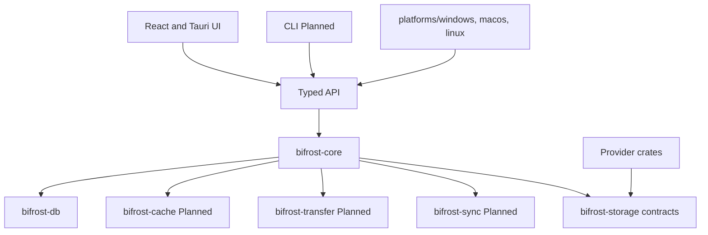

# Architecture

Bifrost Drive separates provider-neutral application services from native operating-system integrations.

The shared crates do not import Tauri or operating-system APIs. Provider implementations are isolated in their own crates and expose only verified capabilities. The desktop process hosts the background application service; closing its main window must not stop synchronization.

## Database

SQLite stores connections, metadata, cache state, transfers, activity, history, pins, and conflicts. It never stores file contents or secret material. Every schema change is a new forward-only migration under `crates/bifrost-db/migrations/`. Migrations run transactionally and are tested from an empty database.

## Native boundaries

Windows CFAPI, Credential Manager, Explorer services, and installer integration belong under `platforms/windows/`. macOS File Provider/Keychain and Linux FUSE/Secret Service are Planned adapters. The CFAPI design uses placeholders and hydration, not a legacy kernel filesystem driver or periodic mirror folder.
