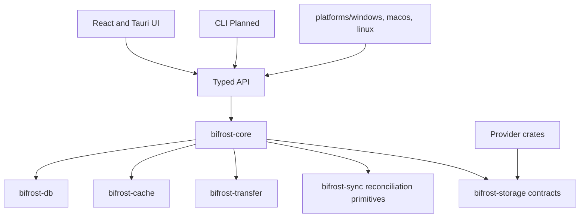

# Architecture

Bifrost Drive separates provider-neutral application services from native operating-system integrations.

The shared crates do not import Tauri or operating-system APIs. Provider implementations are isolated in their own crates and expose only verified capabilities. The desktop host persists transfers, hydrates all current providers, runs scheduled synchronization, routes local CFAPI mutations, and owns native WinFsp mount handles; live-provider native acceptance remains a separate concern.

## Database

SQLite stores connections, metadata, cache state, transfers, activity, history, pins, and conflicts. It never stores file contents or secret material. Every schema change is a new forward-only migration under `crates/bifrost-db/migrations/`. Migrations run transactionally and are tested from an empty database.

## Native boundaries

Windows CFAPI, WinFsp, Credential Manager, Explorer services, and installer integration belong under `platforms/windows/`. macOS File Provider/Keychain and Linux FUSE/Secret Service integrations belong under their platform adapters. CFAPI provides sync-root placeholders and hydration. WinFsp provides independent writable drive letters through provider-backed callbacks and disk-staged writes. The official unmodified WinFsp runtime is installed by the Bifrost installer. Windows VM acceptance remains required.
